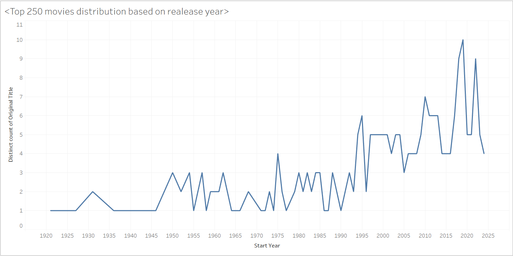

# Summary

tableau visualization of the top 250 highest rated movies taken from [IMDB](https://www.imdb.com/chart/top/?ref_=nv_mv_250)

## Overview

IMDB had 4 datasets but only 2 were used for this visualization. Specifically datasets containing movie information and movie ratings alongside number of votes.

The python script creates a dataset of the top 250 highest rated movies with greater than 40 000 votes.

The tableau visualization highlights the distribution of the top 250 highest rated movies based on their release year. [link to visualization](https://public.tableau.com/app/profile/brahmantya.wardhana/viz/top250_movies_distribution_based_on_release_year/Sheet1?publish=yes)

